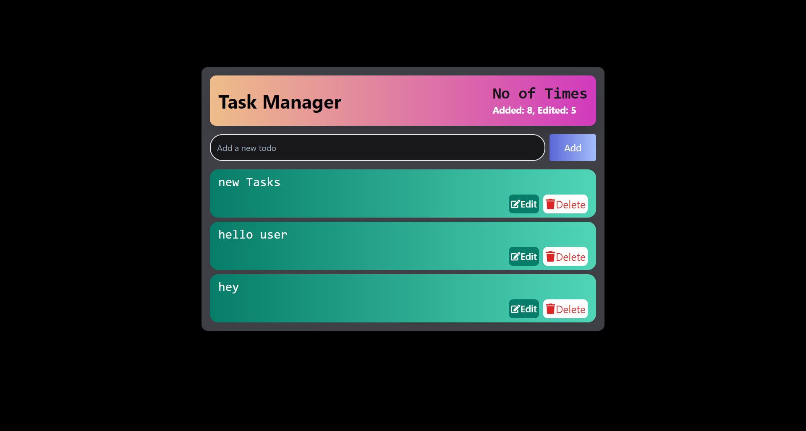

# Task Manager

This project aims to create a task manager application using the MERN (MongoDB, Express.js, React.js, Node.js) stack along with Tailwind CSS. The application allows users to manage tasks efficiently, including adding new tasks, updating existing tasks, and tracking the number of times the add and update functionalities are used.

## Demo
Check out the live demo [here](https://task-manager-rho-one.vercel.app/).

## Features

- **Add**: Clicking the "Add" button clears any existing data, allowing the user to add new entries to the table.
- **Update**: Clicking the "Update" button enables the user to update existing data in the table.
- **Count**: API endpoint to show the number of times the user has called the add and update APIs.

## Technologies Used

- **MongoDB**: A document-oriented NoSQL database used for storing task data.
- **Express.js**: A web application framework for Node.js used for building the backend API.
- **React.js**: A JavaScript library for building user interfaces.
- **Node.js**: A JavaScript runtime environment used for building the backend server.
- **Tailwind CSS**: A utility-first CSS framework for rapid UI development.

